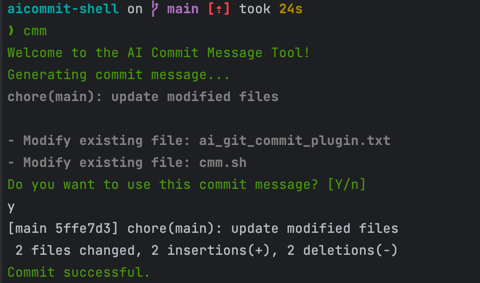

# Git Commit Generator

该脚本利用了 OpenAI 的 GPT-3.5-turbo 模型来生成专业且简洁的 Git Commit 信息。


## Quick Start

```bash
wget -O /usr/local/bin/cmm https://raw.githubusercontent.com/uk0/aicommit-shell/main/cmm.sh && chmod +x /usr/local/bin/cmm
```

## 功能

- 根据 Git 状态生成详细的 commit 信息
- 忽视 .gitignore 文件内列出的文件名
- 使用 GPT-3.5-turbo 生成的描述以帮助分析文件名以生成 commit 信息
- 每个 commit 信息最长不超过 128 个字符，一次最多生成 5 条信息

## 使用方法

1. 首先，需要在您的环境变量中设置 `OPENAI_API_KEY`，这是你从 OpenAI 平台获取的 API 密钥。

   ```bash
   export OPENAI_API_KEY=your-api-key
   ```

2. 运行脚本。脚本会获取当前目录下的 Git 状态，然后发送请求到 OpenAI 平台，最后返回生成的 commit 信息。

   ```bash
    # 你可以将脚本放到 /usr/local/bin/cmm 
    # cp ./cmm.sh /usr/local/bin/cmm && chmod +x /usr/local/bin/cmm
    # 在任意包含git管理的项目下使用 cmm
    ❯ cmm             
     Welcome to the AI Commit Message Tool!
     Generating commit message...
     chore(main): Rename prompt.txt to ai_git_commit_plugin.txt
     - Rename file: prompt.txt to ai_git_commit_plugin.txt
     - Modify existing file: cmm.sh"
     Do you want to use this commit message? [Y/n]
        
   ```

3. 输出结果。脚本会输出生成的 commit 信息，你可以直接使用这些信息作为你的 Git commit message。

## 注意事项

- 确保在你的工作目录下运行该脚本，因为它会获取当前目录下的 Git 状态。
- 脚本运行需要 `jq` 和 `curl`,`vim`。如果你的系统中没有这三个工具，需要先进行安装。
- 该脚本目前只支持英文的文件名分析。

## 示例(old)


假设在你的工作目录下的 Git 状态如下：

```bash
On branch main
Your branch is ahead of 'origin/main' by 1 commit.
  (use "git push" to publish your local commits)

Changes to be committed:
  (use "git restore --staged <file>..." to unstage)
        renamed:    prompt.txt -> ai_git_commit_plugin.txt

Changes not staged for commit:
  (use "git add <file>..." to update what will be committed)
  (use "git restore <file>..." to discard changes in working directory)
        modified:   cmm.sh

```

运行脚本后，可能会返回如下 commit 信息：





### prompt

参考1  https://www.ruanyifeng.com/blog/2016/01/commit_message_change_log.html
<br>
参考2  https://zhuanlan.zhihu.com/p/182553920

#### 目前还不是很完善，还是会存在一些小的问题，提示词相关的还是有一些问题。